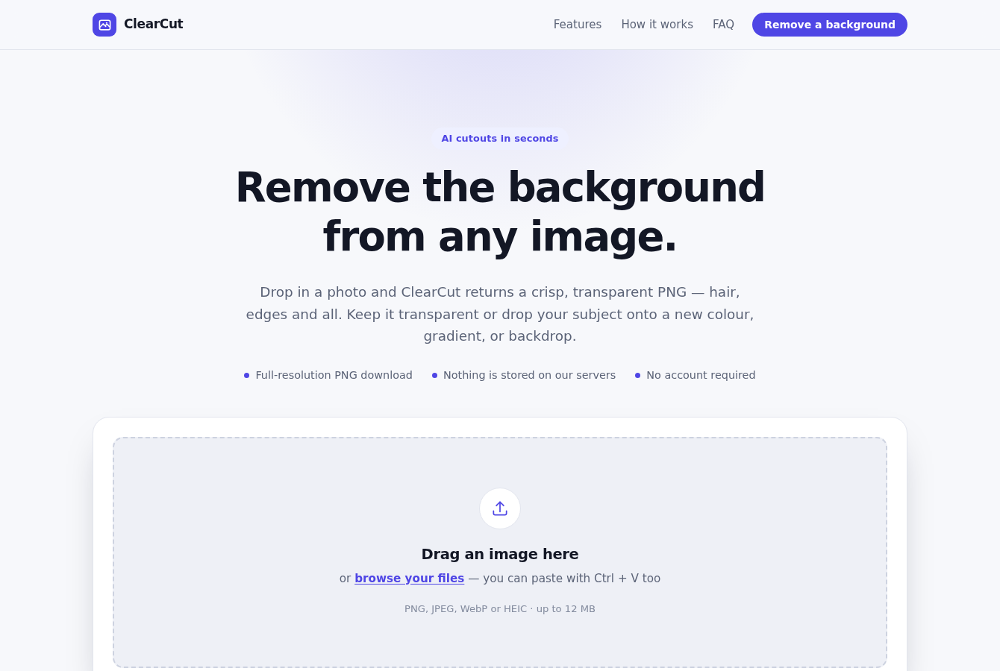
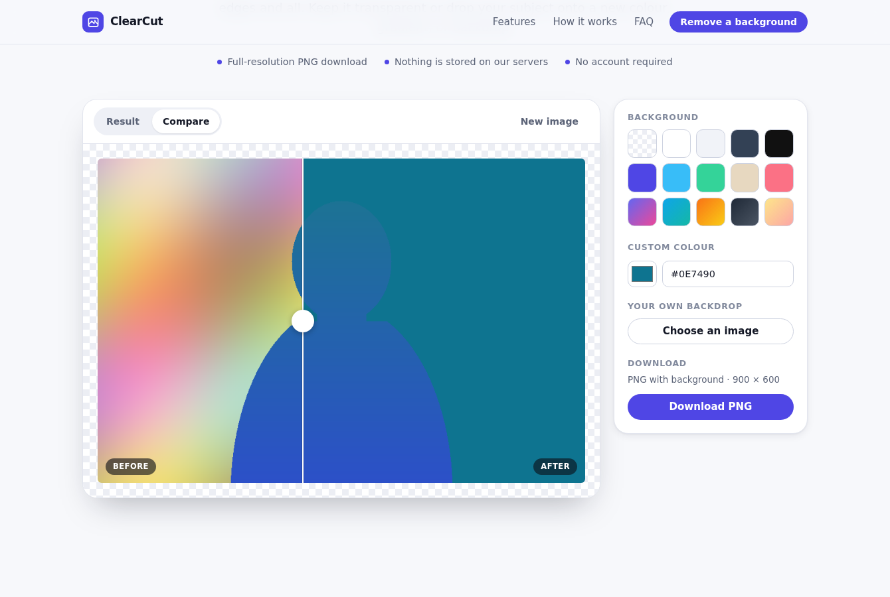

# ClearCut

A background remover: upload an image, get a transparent PNG back, drop the
subject onto a new colour, gradient, or backdrop, and download it at full
resolution. Cutouts come from the [PhotoRoom](https://www.photoroom.com/api)
segmentation API.





## How the API key is protected

The key never reaches the browser, and it is never stored in plaintext.

```
Browser  ──POST /api/remove-background (image only)──▶  ClearCut server
                                                          │  decrypts the key
                                                          │  in memory at boot
                                                          ▼
                                                       PhotoRoom API
                                                       (x-api-key attached here)
```

- **Not in the client.** `public/` contains no key and no PhotoRoom URL. The
  browser talks only to this site's own `/api/remove-background`, which attaches
  the credential server-side.
- **Encrypted at rest.** `.env` holds an AES-256-GCM ciphertext, not the key.
  The passphrase (`KEY_ENCRYPTION_SECRET`) is supplied separately at run time and
  the key is decrypted into process memory only. Key derivation is scrypt with a
  per-value random salt; GCM's auth tag means a tampered blob fails to open
  rather than decrypting to garbage.
- **Never echoed back.** Upstream error bodies are scrubbed of every configured
  secret before they are logged, and are never forwarded to the browser — the
  visitor sees a curated message instead. Startup logs print a fingerprint
  (`sk_pr_…xy (sha256:…)`), never the key.
- **`.env` is git-ignored.** Only `.env.example`, which has empty values, is
  committed.

Encryption at rest raises the bar — a leaked `.env`, a stray backup, or a log
dump is not enough on its own — but it is not magic: anything that can run code
as the server process can read the decrypted key from memory. Keep
`KEY_ENCRYPTION_SECRET` in your host's secret manager rather than beside the
ciphertext, and rotate keys if either half is ever exposed.

## Setup

```bash
npm install
cp .env.example .env
```

Generate a master passphrase and put it in `.env`:

```bash
npm run encrypt-key -- --generate     # prints KEY_ENCRYPTION_SECRET=…
```

Then encrypt each PhotoRoom key. The command prompts for the key so it stays out
of your shell history, and prints the `.env` line to paste:

```bash
npm run encrypt-key                   # live key   → PHOTOROOM_API_KEY_ENC=…
npm run encrypt-key                   # sandbox key → PHOTOROOM_SANDBOX_API_KEY_ENC=…
```

Start it:

```bash
npm start                             # http://localhost:3000
```

Set `PHOTOROOM_MODE=sandbox` in `.env` to develop against the sandbox key — it
is free and returns watermarked previews. `live` bills against your quota and
returns clean cutouts.

## Configuration

| Variable | Default | Purpose |
| --- | --- | --- |
| `KEY_ENCRYPTION_SECRET` | — | Passphrase that unlocks the encrypted keys. Required whenever an `_ENC` key is set. |
| `PHOTOROOM_API_KEY_ENC` | — | Encrypted live key. |
| `PHOTOROOM_SANDBOX_API_KEY_ENC` | — | Encrypted sandbox key. |
| `PHOTOROOM_API_KEY` / `PHOTOROOM_SANDBOX_API_KEY` | — | Plaintext fallbacks. Convenient for a throwaway local run; prefer the encrypted form. |
| `PHOTOROOM_MODE` | `live` | `live` or `sandbox`. |
| `PORT` | `3000` | HTTP port. |
| `MAX_UPLOAD_MB` | `12` | Upload ceiling, enforced in the browser and again on the server. |
| `RATE_LIMIT_MAX` / `RATE_LIMIT_WINDOW_MINUTES` | `30` / `15` | Per-IP throttle on the cutout endpoint. |
| `PHOTOROOM_TIMEOUT_MS` | `60000` | Upstream request timeout. |

## How it works

`POST /api/remove-background` takes the image as the raw request body, with its
MIME type in `Content-Type` and the original name in `X-File-Name`. The bytes
are held in memory — nothing is written to disk — and forwarded to PhotoRoom
with the key attached, retrying transient upstream failures (429/5xx) twice with
backoff. The response is the transparent PNG, sent straight back.

`lib/cutout.js` holds that logic with no framework around it, so the Express
server and the serverless function share one implementation of the validation
and the credential handling rather than two that can drift apart.

Everything after that happens in the browser on a `<canvas>`: colours,
gradients, custom backdrops, the before/after slider, and the download are all
local, so switching backgrounds is instant and costs no extra API calls.

## Layout

```
server.js            Express app for local dev and self-hosting
api/                 Vercel serverless entry points (remove-background, health)
lib/cutout.js        Framework-free request core, shared by both entry points
lib/secure-store.js  AES-256-GCM seal/open, fingerprinting, secret redaction
lib/config.js        Resolves and decrypts configuration at boot
lib/photoroom.js     The only place the key touches an outbound request
scripts/encrypt-key.js  CLI that turns a key into an .env blob
public/              Static front-end (no build step, no dependencies)
test/app.test.js     Crypto, config, server, and serverless-handler tests
vercel.json          Function limits and security headers for the deployment
```

## Tests

```bash
npm test
```

Covers the encryption round-trip, tamper and wrong-passphrase detection, config
resolution, upload validation, the retry path, and — importantly — that the key
appears in neither the served assets, the response headers, nor an error body
when the upstream echoes it back. The suite runs against a mock upstream, so it
needs no network and spends no API credits.

## Deploying to Vercel

Vercel serves `public/` as the site and mounts `api/*.js` as functions, so the
repo deploys as-is:

```bash
npm i -g vercel
vercel link
vercel env add KEY_ENCRYPTION_SECRET production   # paste the passphrase
vercel env add PHOTOROOM_API_KEY_ENC production   # paste the encrypted blob
vercel --prod
```

Add the same two variables to the `preview` environment if you want preview
deployments to work, and `PHOTOROOM_SANDBOX_API_KEY_ENC` plus
`PHOTOROOM_MODE=sandbox` if you want previews to run on the free sandbox key.

Two things behave differently there than when self-hosting:

- **Uploads are capped at 4 MB.** Vercel rejects serverless request bodies over
  about 4.5 MB before the function runs, so `lib/config.js` caps the advertised
  limit when `VERCEL` is set. The browser reads the real limit from
  `/api/health`, so the dropzone and its error messages stay accurate.
- **Rate limiting does not apply.** `express-rate-limit` lives in `server.js`,
  which Vercel does not run, and an in-memory limiter would not hold across
  instances anyway. Use Vercel's own firewall/rate-limiting if you need it on a
  public deployment.

GitHub Pages cannot host this app. Pages serves static files only, so there is
no process to hold the key or call PhotoRoom; the only way to make it work there
would be to ship the key to the browser, which defeats the point.

## Deploying anywhere else

Any Node host runs `npm start` as-is. Set `KEY_ENCRYPTION_SECRET` through the
platform's secret manager rather than in a deployed file, terminate TLS in front
of the app, and keep `trust proxy` accurate so the rate limiter sees real client
IPs.
